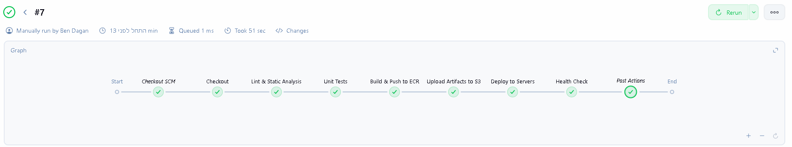
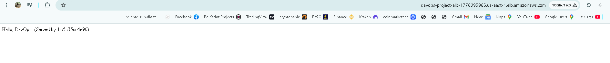
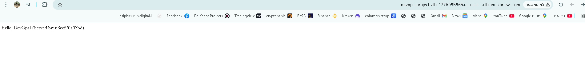
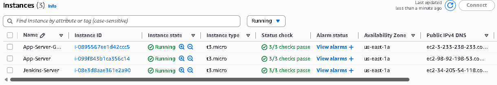

# End-to-End DevOps CI/CD Project with AWS, Terraform & Jenkins 🚀

This project demonstrates a complete DevOps lifecycle using **Infrastructure as Code (IaC)**, **Containerization**, and **CI/CD Pipelines**.
The system automatically provisions a High-Availability AWS infrastructure (ALB + 2 App Servers), tests Python code, builds Docker images, and deploys them.

## 🛠 Tech Stack
* **Infrastructure:** Terraform (VPC, Subnets, EC2, IAM, ECR, S3, ALB)
* **CI/CD:** Jenkins (Declarative Pipeline)
* **Containerization:** Docker & Docker Compose
* **Registry:** AWS ECR (Elastic Container Registry)
* **Application:** Python Flask
* **Version Control:** GitHub

## 🏗 Architecture & Features
1.  **High Availability:** An **Application Load Balancer (ALB)** distributes traffic between two EC2 Application Servers (Blue/Green architecture).
2.  **Infrastructure as Code:** Terraform manages the entire state, stored remotely in S3.
3.  **Jenkins Pipeline:**
    * **Linting & Testing:** `flake8` and `pytest` run on every commit.
    * **Build & Push:** Creates a Docker image and pushes it to AWS ECR.
    * **Artifact Management:** Zips source code and uploads to S3.
    * **Deploy:** Automatically updates both application servers via SSH.
4.  **Security:** Uses IAM Roles for secure access (no hardcoded keys).

---

## 📸 Project Tour & Demo

### 1. The CI/CD Pipeline
A visualization of the complete automated pipeline in Jenkins. Every commit triggers a lint check, unit tests, Docker build, ECR push, and deployment to all servers.


### 2. High Availability & Load Balancing in Action
The Application Load Balancer (ALB) distributes traffic between the two servers.
Notice the **"Served by"** hostname changes between requests, proving the load balancing works perfectly (Round Robin).

**Server A (Blue):**


**Server B (Green):**


### 3. AWS Infrastructure Provisioning
Terraform successfully provisioned the entire environment, including the Jenkins Server and the two Application Nodes.


---

## 🚀 How to Run

### 1. Provision Infrastructure
Navigate to the `infra` folder and run:
```bash
terraform init
terraform apply

```

### 2. Configure Jenkins

* Access Jenkins via the output IP.
* Install plugins: **Docker**, **SSH Agent**, **Pipeline Utility Steps**.
* Configure AWS Credentials & `app-server-ssh-key`.
* Create a Pipeline job triggered by GitHub Webhook.

### 3. Deploy

Push changes to the `main` branch. Jenkins will automatically trigger the pipeline, run tests, build the image, and deploy to both servers behind the ALB.

## 📂 Project Structure

* `/infra` - Terraform configuration files (ALB, VPC, EC2, SG).
* `/app` - Python Flask source code, Dockerfile & Tests.
* `Jenkinsfile` - CI/CD Pipeline definition.

```

